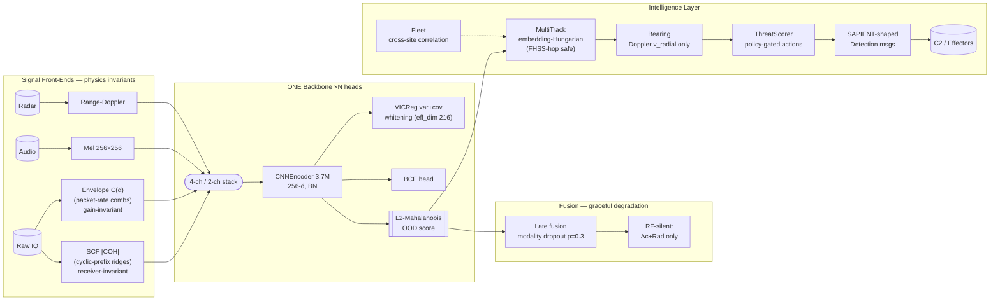

# IRIS — Identify, Recognize, Isolate, Spot

**Self-supervised counter-UAS sensing: RF + RF-silent drone detection from ONE small architecture, multi-sensor fusion, and an intelligence layer — all edge-deployable (~13 MB ONNX, ~10 ms).**

IRIS answers one question from raw radio energy: *"is that a drone — even a kind we've never seen?"* — then keeps its identity over time, scores the threat, and hands a structured track to whatever comes next (C2, jammer, interceptor). It listens passively, so it needs no transmit license.

[](#license) [](https://modal.com)

---

## 1. Why this exists

Consumer drones are now the dominant low-altitude threat — border smuggling, airport shutdowns, critical-infrastructure overflights. Two hard problems make most detectors fragile:

1. **Receiver dependence.** Naive spectrogram models learn *the radio that captured the signal* (its gain, AGC, filter shape), not the drone. Change receivers → accuracy collapses.
2. **Protocol dependence.** A detector tuned to one modulation (e.g., DJI's OFDM) is blind to others (FHSS controllers, analog video) and to RF-silent drones.

IRIS attacks both with **physics-informed inputs + one self-supervised backbone**, and states its boundary honestly instead of hiding it.

## 2. Results at a glance

| Capability | Number | Status |
|---|---|---|
| **RF detection, unseen DJI types** (SCF v3) | **99.7%**, AUC 1.0, 0% FP | ✅ production |
| SNR robustness | **100%** detection @ 0–30 dB | ✅ |
| Leave-one-type-out (11 Zenodo types) | 98.75% | ✅ |
| Acoustic (DADS), same backbone | AUC **0.999** (was 0.869 on 80 clips → 3,900) | ✅ proof of scaling |
| Fusion RF-silent (acoustic+radar, RF zeroed) | 92.5%, AUC 1.0 *(synthetic pairing — see limits)* | ⚠️ prototype |
| **FHSS envelope-coherence framework** (Proof 1a) | comb at exact rates, SNR>28K, gain-invariance ~1e-16 | ✅ validated |
| **Real ELRS capture** (Proof 1b) | stable f0≈49.5Hz comb, matches paper timing ±1% (3rd harm.) | ✅ measured |
| **ONE encoder, OFDM+FHSS** (hybrid, first run) | AUC **0.82** FHSS-vs-BG, **0.82** OFDM-vs-BG, BG FP 3% | 🟡 first working numbers |

Also in-repo (earlier builds): RF-only intent classification (ATTACK recall 93%), Remote-ID spoof detection via fingerprinting, AVR-CL continual learning (1.6× EWC).

---

## 3. What / Why / How — the three ideas that make it work

### Idea 1 — The input carries the physics (this is where generality is won or lost)

Raw IQ is just a spinning phasor. We convert it to images whose *structure* is the drone's protocol, not the capture chain:

- **SCF \|COH\| (OFDM path).** OFDM copies each symbol's tail to its front (cyclic prefix). That repetition makes the signal correlated with a frequency-shifted copy of itself at cycle frequency `α = k/T_symbol`. The Spectral Correlation Function measures exactly this; dividing by power (**spectral coherence, |COH|**) cancels receiver gain/AGC *by construction*. DJI, Parrot, Yuneec — all OFDM-family links share these ridges even across models/generations. This is why frozen v3 detects 8 unseen DJI types at 99.7% and holds 100% down to 0 dB SNR: the CNN isn't memorizing drones, it's reading a physics invariant.
- **Envelope coherence (FHSS path).** FHSS controllers (ExpressLRS/Crossfire) have no cyclic prefix — SCF sees nothing. But they do something else no background does: they burst at a **fixed, known packet rate** (ELRS 500/250/150Hz…) on hopping carriers. So we retarget the same coherence idea to the *power envelope*: envelope → cyclic autocorrelation → regularity-normalized comb `C(α) = |Σ R_e(α,τ)|²/(P̄·R_e(0))`. Regularity transfers across receivers even when amplitude doesn't.
  - *Proof 1a (validated):* combs land at exact rates (501.3/250.3/150.2 Hz, SNR 28K–145K); scaling IQ by ×316 or ÷1000 moves the statistic by ~1e-16; a harmonic discriminator separates fixed-rate TDMA from WiFi-style irregular bursts (score 60 vs 0.6).
  - *Proof 1b (real data):* an actual RadioMaster BOXER ELRS capture shows a stable f0 ≈ 49.5 Hz comb across independent windows, consistent with published hop-timing.
- **Why not plain STFT?** Our first stack (v11) used STFT spectrograms and *learned the receiver*, not the drone — a documented failure mode (±20 dB gain perturbation collapses un-normalized models from 0.96 → 0.51). STFT remains useful only when paired with per-sample normalization + MixStyle/GRL-style domain randomization; SCF/envelope coherence get invariance from math instead.

### Idea 2 — One tiny backbone, trained to be readable by Mahalanobis

Every modality feeds the **same 3.7M-parameter CNN** (`extension/src/encoders/backbone.py`) into a 256-d embedding:

- **VICReg** (variance+covariance penalties) prevents representation collapse and *whitens* the embedding space. This is not cosmetic: our first SCF encoder without it collapsed to 2 usable dimensions; with it, effective dim = 216/256 and the covariance penalty drops 4.3× during training.
- **BCE head** supplies the discriminative signal (drone vs background).
- **L2-normalized Mahalanobis distance** to the drone centroid turns the whitened geometry into an OOD score. Because VICReg pre-whitened the space, unseen-but-related drones land inside a well-conditioned boundary while background lands ~2.25σ away — that's why false positives are 0% and hard-negative removal doesn't move AUC.

The lesson we paid for: **input × data >> loss function.** Switching STFT→SCF and RC-controller-heavy→OFDM-family data took DRFF-R2 detection from 0%→98.5%; adding VICReg polished it to 99.7%. LeJEPA/Hierarchical-SupCon machinery in `src/` is kept as the principled lineage (`build.md`), but production doesn't need it once the input exposes shared structure.

### Idea 3 — Same backbone ⇒ multi-sensor by construction, and it scales with data

Because the backbone is input-agnostic (any 256×256 physics image), adding a sensor is adding a *front-end*, not a new model:

```
IQ ──► SCF |COH|      ┐
IQ ──► Envelope-C(α)  ├─► [stacked channels] ─► ONE CNNEncoder(256-d) ─► VICReg space ─► Mahalanobis
Audio ► Mel           │                                              ▲
Radar ► Range-Doppler ┘   late fusion (modality dropout p=0.3) ──────┘
```

- Acoustic proved the scaling claim: 80 clips → 0.869 AUC; 3,900 clips → **0.999** (same arch, same loss — only data changed).
- Modality dropout trains the fusion to survive any sensor missing: zeroing RF retains 92.5% accuracy / 100% AUC (synthetic pairing today — honestly labeled below).
- First hybrid run (SCF + envelope in one 4-ch encoder): **AUC 0.82 FHSS-vs-BG and 0.82 OFDM-vs-BG** from a 484-sample corpus — directionally proves one-weight-set universality; calibration-limited, not architecture-limited.

### The intelligence layer (from detections to decisions)

`extension/src/intelligence/` + `sapient/` + `fleet/` turn per-frame scores into C2 products:

- **MultiTrackManager** — re-identifies hopping signals by *embedding similarity* (Hungarian assignment), so one FHSS drone visiting 10 channels stays one track; swarm alarm requires stable tracks (≥3 detections, ≥2 s), killing the classic false-swarm bug.
- **BearingEstimator** — Doppler radial velocity (`v = Δf·c / 2f₀`) only; azimuth is `None` until a coherent array (KrakenSDR/MUSIC) or multi-node TDOA exists. No fake numbers.
- **ThreatScorer** — 0–100 composite (type, intent, trajectory, signal, context) with **policy-gated** recommended actions (no autonomous "jam": RF jamming is license-controlled in most jurisdictions).
- **SAPIENT-shaped output** — Detection/Track messages modeled on UK Dstl's SAPIENT (BSI Flex 335 v2.0) philosophy: send information, not raw data.
- **Fleet coordination** — cross-site embedding correlation ("seen at N sites") + privacy-preserving weight sharing.

Full system map: see [`ARCHITECTURE.md`](ARCHITECTURE.md) (diagrams for every stage, wired to file paths).

---

## 4. System architecture (full diagram)



Stage-by-stage explanation (inputs, formulas, file paths, failure modes): **[`ARCHITECTURE.md`](ARCHITECTURE.md)**.

---

## 5. Repository layout

```
src/                            # v11 research stack (LeJEPA + SIGReg(Cramér-Wold) + HierSupCon, STFT)
extension/
  src/encoders/backbone.py      # canonical 3.7M CNNEncoder + losses (use for new work)
  src/fusion.py                 # late fusion + ModalityDropout
  src/intelligence/             # multi_track, bearing, threat_scoring, drone_id
  src/sapient/output_schema.py  # SAPIENT-shaped messages
  src/fleet/coordination.py     # cross-site correlation + weight deltas
  src/scf_features.py           # SCF |COH| + 4-ch hybrid feature builders
  scripts/scf_pipeline/         # Zenodo SCF generation, v3 training, holdout/OOD evals
  scripts/experiments/          # fhss_proof1_dsp / proof1b_real / hybrid_universal_train …
configs/split.json              # 30/7 train-holdout split
tests/test_contracts.py         # contract tests (loss keys, dims, Mahalanobis, determinism)
results/                        # committed JSON/MD evidence for every headline number
docs/, build.md, ARCHITECTURE.md
```

## 6. Quick start

```bash
pip install -r requirements_demo.txt
python scripts/pull_from_modal.py          # fetch checkpoints from Modal volumes
python scripts/unified_demo.py             # end-to-end capability demo
python scripts/live_demo.py                # synthetic | HDF5 replay | IQ-file modes
```

Reproduce key results (Modal T4, ≈$0.40/h):

```bash
modal run extension/scripts/scf_pipeline/spawn_train_v3_vicreg.py    # v3 SCF encoder
modal run extension/scripts/scf_pipeline/spawn_fusion_rfsilent.py    # RF-silent ablation
python3 extension/scripts/experiments/fhss_proof1_dsp.py             # envelope framework
python3 extension/scripts/experiments/fhss_proof1b_real.py           # real ELRS capture test
python3 extension/scripts/experiments/hybrid_universal_train.py      # ONE-encoder OFDM+FHSS
```

## 7. Datasets

| Dataset | Role | Notes |
|---|---|---|
| Zenodo 4264467 (Pärlin, Tampere) | v3 SCF training (12 bins on volume) | CC-BY-4.0, anechoic, 120/200 MS/s |
| DRFF-R2 | cross-dataset OOD eval (26 units / 8 DJI) | CC-BY-4.0 |
| RFUAV (arXiv:2503.09033) | 37-type diversity; BOXER rar used for FHSS proof | Apache-2.0 |
| DADS (HF geronimobasso) | acoustic positives (180k clips) | MIT |
| ESC-50 | acoustic negatives | CC-BY-NC |
| DIAT-μSAT (IEEE DataPort) | radar upgrade path (4,849 imgs) | academic |

## 8. Evaluation hygiene

- **Recording-grouped CV** (Shulman arXiv:2607.01025): segments of one recording never straddle train/test — segment-level splitting inflates RF benchmarks by up to 30 points.
- **L2-normalized Mahalanobis** (Mahalanobis++): normalize embeddings before fitting/scoring; decisive for cross-receiver transfer.
- Multi-seed, bootstrap CIs, per-SNR curves, and explicit negative controls (shuffle tests for any fused result).

## 9. Known limitations (we ship them, not hide them)

| Limitation | Why | Path forward |
|---|---|---|
| Fusion 92.5% uses synthetic pairing | no public time-aligned RF+audio corpus ingested yet | TSMS-Drone (figshare, RF+CW+FMCW aligned) + shuffle/OR/AND baselines |
| Hybrid encoder thresholds are calibration-poor | 484 samples, 102 fit embeddings | more ELRS captures (multiple rates) + more OFDM windows; conformal threshold |
| Urban WiFi-hole untested for SCF | Wi-Fi is also CP-OFDM; margin BG 0.97 vs drone 1.02 is thin | dense urban captures through frozen v3; reframe as *protocol-topology* fingerprint |
| Radar encoder data-starved | 50 UAV signatures | DIAT-μSAT 4,849 X-band images |
| Fiber/dark drones emit no RF | physics, not a bug | rotor micro-Doppler (radar) + BPF acoustics |
| FHSS SNR floor expected higher than OFDM | weaker cyclic feature by design | honest per-SNR ROC (Stage 4 of Future Work) |

## 10. Future research & works

### FHSS coverage via the same coherence framework

**One-line pitch:** v3's architecture (CNN + VICReg + BCE + Mahalanobis) is modulation-agnostic — everything downstream of the input stays frozen; only *which* cyclic frequencies the coherence step searches changes.

1. **Target periodicity:** α-bank from ELRS/Crossfire packet cadence (verified table: 500Hz→2ms… hop-set 80ch, cycle 1.28s; Crossfire 150Hz/50ch/~1.0s) + GFSK symbol rate as fallback.
2. **Receiver-invariant feature:** envelope-domain |COH| analogue — regularity normalized by local power (implemented & validated above).
3. **Frozen backbone:** feed the new image to the unchanged 3.7M encoder.
4. **Same rigor:** cross-receiver FHSS test (currently missing entirely), LOTO, per-SNR ROC with the expected narrower window reported openly.
5. **Data first:** real ELRS/Crossfire IQ with ground-truth packet timing is the true bottleneck — named as blocking task #1, not a footnote.

*Risks stated upfront:* weaker/noisier cyclic feature than CP; "regular bursting ≠ ELRS specifically" (must match known rates); longer windows needed (hop-period periodicity spans multiple hops).

> *"FHSS is not a new detector — it's the same coherence-based invariance principle, retargeted at ELRS packet periodicity instead of OFDM's cyclic prefix."*

### Beyond

- **RF-silent at scale:** DADS 180k via HDF5 streaming; DIAT-μSAT radar; micro-Doppler dwell study (20 ms optimal).
- **Real multi-sensor fusion:** TSMS-Drone time-aligned benchmark replacing synthetic pairing; transformer early fusion.
- **Intelligence at scale:** 3-node TDOA pilot positioning (KrakenSDR class), BSI Flex 335 Protobuf certification.

## 11. Theory snapshot

LeJEPA lineage: if latents are Gaussian, SIGReg's Cramér-Wold matching makes the encoder linearly identifiable — and RF hardware impairments (CFO, phase noise, PA nonlinearity) are Gaussian by DSP physics. In production, VICReg performs the practical whitening that lets Mahalanobis treat "far from centroid" as evidence. SCF |COH| and envelope C(α) are the physics priors that put shared structure into the input *before* any learning. Full derivations: `build.md`, `extension/scripts/scf_pipeline/results/ABCD_SUMMARY.md`.

## References

Klindt/LeCun/Balestriero *LeJEPA* '26 · Bardes et al. *VICReg* 2105.04906 · Shi et al. *RFUAV* 2503.09033 · Shulman *benchmark overstatement* 2607.01025 · Lee et al. *Mahalanobis OOD* NeurIPS'18 · Gazit et al. *OTA adversarial RF attacks* 2512.20712 · Gardner *cyclostationarity* '86 · Randall *envelope spectra* MSSP'01 · Zhou et al. *MixStyle* ICLR'21 · Ganin et al. *GRL* '16 · Dstl *SAPIENT / BSI Flex 335 v2.0* '24.

## License & citation

Research use. Dataset licenses apply (CC-BY-4.0 / Apache-2.0 / MIT as listed).

```bibtex
@software{iris_2026,
  title  = {IRIS: Self-supervised multi-sensor counter-UAS sensing},
  author = {Aryan},
  year   = {2026},
  url    = {https://github.com/ARYAN2302/IRIS}
}
```
