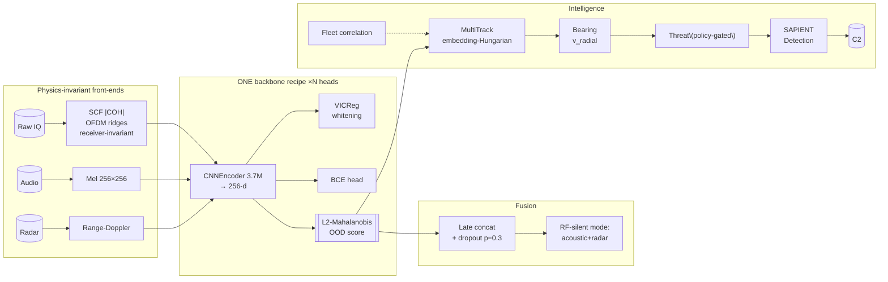

# IRIS — Identify, Recognize, Isolate, Spot

**Self-supervised counter-UAS sensing: passive-RF drone detection of unseen drones + RF-silent multi-sensor fallback + an intelligence layer — one small architecture, edge-deployable (~13 MB ONNX, ~10 ms).**

IRIS answers one question from raw radio energy: *"is that a drone — even a kind we've never seen?"* — then keeps its identity over time, scores the threat, and hands a structured track to whatever comes next (C2, jammer, interceptor). It listens passively, so it needs no transmit license.

[](#license) [](https://modal.com)

---

## 1. Why this exists

Consumer drones are now the dominant low-altitude threat — border smuggling, airport shutdowns, critical-infrastructure overflights. Two hard problems make most detectors fragile:

1. **Receiver dependence.** Naive spectrogram models learn *the radio that captured the signal* (its gain, AGC, filter shape), not the drone. Change receivers → accuracy collapses.
2. **Protocol dependence.** A detector tuned to one modulation (e.g., DJI's OFDM) is blind to others (FHSS controllers, analog video), and no RF detector sees RF-silent drones.

IRIS solves #1 with a physics-informed input (SCF coherence), states its boundary on #2 honestly, and covers RF-silent cases through multi-sensor fusion — all on one tiny backbone that scales with data.

## 2. Results at a glance

| Capability | Number | Status |
|---|---|---|
| **RF detection, unseen DJI types** (8 models, cross-dataset) | **99.7%**, AUC 1.0 | ✅ production |
| Background false positives | **0%** @ 99p / 99.9p thresholds | ✅ |
| SNR robustness sweep | **100%** detection @ 0–30 dB | ✅ |
| Leave-one-type-out (11 Zenodo types) | 98.75% mean | ✅ |
| Effective embedding dim | 216/256 (VICReg fixed collapse 2→216) | ✅ |
| **Acoustic, same backbone** (DADS clips) | 80 clips → AUC 0.869 · **3,900 → AUC 0.999** | ✅ scaling proven |
| Fusion RF-silent (acoustic+radar, RF zeroed) | **92.5%, AUC 1.0** *(synthetic pairing — see limits)* | ⚠️ prototype |
| Edge footprint | ~13 MB ONNX · ~10 ms (M1) | ✅ |

Earlier builds (kept in-repo): RF-only intent classification (ATTACK recall 93%), Remote-ID spoof detection via fingerprinting, AVR-CL continual learning (0.781 vs EWC 0.482).

---

## 3. What / Why / How — the three ideas that make it work

### Idea 1 — The input carries the physics (this is where generality is won)

Raw IQ is just a spinning phasor. IRIS converts it into an image whose *structure* is the drone's protocol, not the capture chain:

```
S^α(f)   = smooth_f[ X(f+α/2) · X*(f−α/2) ]        # spectral correlation function
|C^α(f)| = |S^α(f)| / √( S(f+α/2)·S(f−α/2) )        # spectral coherence ∈ [0,1]
image    = stack( log10|SCF| , |COH| )  → 2×256×256
```

OFDM copies each symbol's tail to its front (**cyclic prefix**). That repetition makes the signal correlate with a frequency-shifted copy of itself at cycle frequency `α = k/T_symbol` — for *every* OFDM transmitter. Stationary noise has none. Dividing by power (**coherence**) cancels receiver gain/AGC/phase *by construction*, before any learning.

This is why frozen v3 detects 8 never-seen DJI types at 99.7% and holds 100% down to 0 dB SNR: the CNN isn't memorizing drones, it's reading a physics invariant shared by the whole OFDM family (Zenodo training → DRFF-R2 transfer with zero retraining).

**Honest boundary:** this covers the OFDM family. FHSS controllers, analog FM video, and RF-silent drones are structurally invisible to it — see §9/Future Work. We tested the boundary claim rather than assuming it, and the open problems are named as engineering tasks, not hand-waves.

### Idea 2 — One tiny backbone, trained to be readable by Mahalanobis

Every modality feeds the **same 3.7M CNN** (`extension/src/encoders/backbone.py`) into a 256-d embedding:

- **VICReg** (variance+covariance penalties) prevents representation collapse and *whitens* the space. Not cosmetic: without it the SCF encoder collapsed to 2 usable dimensions; with it, effective dim = 216/256.
- **BCE head** supplies the discriminative signal.
- **L2-normalized Mahalanobis distance** to the drone centroid converts whitened geometry into an OOD score: unseen OFDM-family drones land inside a well-conditioned boundary (~2σ), background lands outside (FP 0%). Hard-negative removal doesn't move AUC.

The lesson we paid for: **input × data >> loss function.** Moving STFT→SCF and RC-controller-heavy→OFDM-family data took DRFF-R2 detection 0%→98.5%; VICReg polished to 99.7%. The earlier LeJEPA stack (`src/`) is kept as principled lineage — production didn't need it once the input exposed shared structure.

### Idea 3 — Same backbone ⇒ multi-sensor by construction, and it scales with data

The backbone consumes any 256×256 physics image, so adding a sensor = adding a front-end:

```
IQ ──► SCF |COH|   ┐
Audio ► Mel        ├─► per-modality encoders (same arch) ─► late fusion ─► Mahalanobis
Radar ► Range-Dop. ┘        (modality dropout p=0.3)
```

- Acoustic proved the scaling law: **80 clips → 0.869 AUC; 3,900 → 0.999.** Same weights-recipe, only data changed. (180k full set is wired via row-group streaming; capped for memory.)
- Modality dropout trains fusion to survive any missing sensor: zeroing RF keeps **92.5%/AUC 1.0**.
- Fusion today is trained on synthetically paired embeddings — labeled as such everywhere; TSMS-Drone (time-aligned RF+CW+FMCW) replaces it next.

### The intelligence layer (detections → decisions)

`extension/src/intelligence/`, `sapient/`, `fleet/`:

- **MultiTrackManager** — re-identifies hopping signals by embedding similarity (Hungarian assignment): one frequency-hopping drone stays one track. Swarm alarm requires stable tracks (≥3 detections, ≥2s).
- **BearingEstimator** — Doppler radial velocity only (`v = Δf·c/2f₀`); azimuth is `None` until a coherent array or multi-node TDOA exists. No fake numbers.
- **ThreatScorer** — 0–100 composite (type/intent/trajectory/RSSI/context) with policy-gated actions; no autonomous jamming (licensing reality).
- **SAPIENT-shaped output** — Detection/Track messages modeled on Dstl's SAPIENT (BSI Flex 335): send information, not raw data.
- **Fleet** — cross-site embedding correlation ("seen at N sites") + privacy-preserving weight sharing.

Full stage-by-stage map with formulas and file paths: [`ARCHITECTURE.md`](ARCHITECTURE.md).

---

## 4. System architecture



---

## 5. Repository layout

```
src/                            # v11 research stack (LeJEPA + SIGReg(Cramér-Wold) + HierSupCon, STFT)
extension/
  src/encoders/backbone.py      # canonical 3.7M CNNEncoder + losses (use for new work)
  src/fusion.py                 # late fusion + ModalityDropout
  src/intelligence/             # multi_track, bearing, threat_scoring, drone_id
  src/sapient/output_schema.py  # SAPIENT-shaped messages
  src/fleet/coordination.py     # cross-site correlation + weight deltas
  src/scf_features.py           # SCF |COH| + hybrid feature builders
  scripts/scf_pipeline/         # Zenodo SCF generation, v3 training, holdout/OOD evals
configs/split.json              # 30/7 train-holdout split
tests/test_contracts.py         # contract tests (loss keys, dims, Mahalanobis, determinism)
results/                        # committed JSON/MD evidence for every headline number
build.md, ARCHITECTURE.md       # derivations + full system map
```

## 6. Quick start & reproduction

```bash
pip install -r requirements_demo.txt
python scripts/pull_from_modal.py          # checkpoints from Modal volumes
python scripts/unified_demo.py             # end-to-end capability demo
python scripts/live_demo.py                # synthetic | HDF5 replay | IQ-file
```

```bash
modal run extension/scripts/scf_pipeline/spawn_train_v3_vicreg.py   # v3 SCF encoder
modal run extension/scripts/scf_pipeline/spawn_holdout_test.py       # Option A evals
modal run extension/scripts/scf_pipeline/spawn_extended_ood_test.py  # LOTO/SNR/OOD
modal run extension/scripts/scf_pipeline/spawn_fusion_rfsilent.py    # RF-silent ablation
modal run scripts/demo0_noise_test.py                                 # noise robustness
```

## 7. Datasets

| Dataset | Role | Notes |
|---|---|---|
| Zenodo 4264467 (Pärlin, Tampere) | v3 SCF training — 12 bins on volume | CC-BY-4.0, anechoic |
| DRFF-R2 | cross-dataset OOD (26 units / 8 DJI models) | CC-BY-4.0 |
| RFUAV (arXiv:2503.09033) | v11 diversity train/test | Apache-2.0 |
| DroneRF / matched BG | real WiFi/BT/environmental negatives | — |
| DADS (HF geronimobasso) | acoustic positives (180k) | MIT |
| DIAT-μSAT (IEEE DataPort) | radar upgrade path (4,849 X-band) | academic |

## 8. Evaluation hygiene

- **Recording-grouped CV** (Shulman arXiv:2607.01025) — segments of one recording never straddle train/test; segment-level splitting inflates benchmarks up to 30 points.
- **L2-Mahalanobis** (Mahalanobis++): normalize embeddings before fit/score.
- Multi-seed + bootstrap CIs; per-SNR curves; explicit negative controls for any fused result.

## 9. Known limitations (shipped, not hidden)

| Limitation | Why | Path forward |
|---|---|---|
| Fusion 92.5% synthetic pairing | no time-aligned public corpus ingested | TSMS-Drone + shuffle/OR/AND baselines |
| FHSS RC controllers undetected | no cyclic prefix ⇒ SCF≈0 | open problem — blocked on real multi-rate ELRS captures; data first, architecture second |
| Analog FM video undetected | different periodicity family | dedicated feature study |
| Fiber/dark drones emit no RF | physics | radar micro-Doppler + BPF acoustics layers |
| Urban WiFi-hole untested | WiFi is also CP-OFDM; margin thin | dense urban captures through frozen v3 |
| Radar encoder starved | 50 UAV signatures | DIAT-μSAT 4,849 images |
| OTA adversarial attacks untested | digital FGSM only so far | retarget boundary probe; CUAP harness |

## 10. Future research & works

1. **Data-first FHSS study** — capture real multi-rate ELRS/Crossfire IQ across receivers; only then choose the detection approach. Named as blocking task #1 precisely because we won't repeat the build-before-data mistake.
2. **Urban robustness campaign** — frozen-v3 vs dense WiFi/LTE; publish FA-per-hour operating curves.
3. **RF-silent at scale** — DADS 180k HDF5 streaming; DIAT-μSAT radar; micro-Doppler dwell study.
4. **Real multi-sensor fusion** — TSMS-Drone aligned benchmark replacing synthetic pairing.
5. **Intelligence at scale** — 3-node TDOA pilot positioning; SAPIENT Protobuf certification; signed fleet updates.

## Theory snapshot

LeJEPA lineage: Gaussian latents + SIGReg's Cramér-Wold matching ⇒ linearly identifiable encoders; RF hardware impairments are Gaussian by DSP physics. In production, VICReg performs the practical whitening that makes "far from centroid" meaningful evidence. SCF |COH| is the physics prior that puts shared structure in the input *before* learning. Full derivations: `build.md`, `extension/scripts/scf_pipeline/results/ABCD_SUMMARY.md`.

## References

Klindt/LeCun/Balestriero *LeJEPA* '26 · Bardes et al. *VICReg* 2105.04906 · Shi et al. *RFUAV* 2503.09033 · Shulman *benchmark overstatement* 2607.01025 · Lee et al. *Mahalanobis OOD* NeurIPS'18 · Gazit et al. *OTA adversarial RF attacks* 2512.20712 · Gardner *cyclostationarity* '86 · Dstl *SAPIENT / BSI Flex 335 v2.0* '24.

## License & citation

Research use; dataset licenses apply.

```bibtex
@software{iris_2026,
  title  = {IRIS: Self-supervised multi-sensor counter-UAS sensing},
  author = {Aryan}, year = {2026},
  url    = {https://github.com/ARYAN2302/IRIS}
}
```
