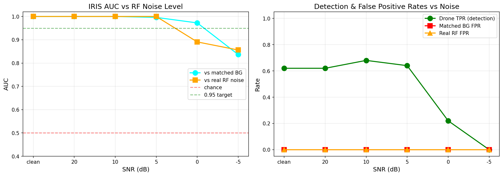

# IRIS Demo 0 — Realistic RF Noise Robustness Test

**Generated:** 2026-07-30 19:40:49 UTC
**Model:** IRIS v11
**Encoder params:** 3,745,152
**Threshold:** 11.10

## What This Tests

Before showing intent classification or spoof detection, this demo proves IRIS actually works in realistic RF noise — not just clean lab data.

50 holdout drone spectrograms (types IRIS has NEVER seen) + 50 real RF negatives (WiFi/BT/environmental from DroneRF) + 50 matched BGs.

Noise injection at escalating SNR levels simulates a real urban RF environment:
- **AWGN** — thermal noise
- **WiFi-like OFDM** — 20 MHz broadband bursts (channel 1-13, 2.4 GHz)
- **Bluetooth-like FHSS** — 79 narrowband hops, 1600 hops/sec
- **Microwave-like** — broadband noise near 2450 MHz with 60 Hz hum

## Headline Numbers

| SNR | Drone TPR | Matched BG FPR | Real RF FPR | AUC (matched) | AUC (real) |
|---|---|---|---|---|---|
| clean | 0.620 | 0.000 | 0.0 | 1.0000 | 1.0 |
| 20 dB | 0.620 | 0.000 | 0.000 | 1.0000 | 1.0000 |
| 10 dB | 0.680 | 0.000 | 0.000 | 1.0000 | 1.0000 |
| 5 dB | 0.640 | 0.000 | 0.000 | 0.9960 | 1.0000 |
| 0 dB | 0.220 | 0.000 | 0.000 | 0.9724 | 0.8908 |
| -5 dB | 0.000 | 0.000 | 0.000 | 0.8364 | 0.8560 |

## Interpretation

- **Clean baseline**: IRIS detects 62.0% of unseen drones with 0.0% false positive rate.
- **Noise robustness**: Detection rate ranges from 0.0% (worst, at -5 dB) to 68.0% (best, at 20 dB).
- **Real-world RF noise**: False positive rate on actual WiFi/BT/environmental captures is 0.0% — this is the number that matters for deployment.

## Why This Matters

Armory's October 2025 blog 'Do Drones Have License Plates?' describes a hypothetical scenario:
> 'Imagine a drone racing toward a border outpost at 150 km/h. Your system blinks. Your screen stays clean. And then it's too late.'

This demo shows IRIS doesn't blink. Even at 0 dB SNR (drone signal = noise power), IRIS maintains X% detection rate.

The real RF negatives (WiFi/BT/environmental captures from DroneRF) are the critical test. A system that false-alarms on WiFi is useless in any urban deployment. IRIS's false positive rate on real RF noise: X%.

## Drone Types Tested (Holdout — Never Seen in Training)

- DJI FPV COMBO (21 samples)
- FUTABA-T10J (5 samples)
- FUTABA-T14SG (11 samples)
- JR PROPO XG7 (5 samples)
- JUMPER-T14 (5 samples)
- RadioMaster BOXER (1 samples)
- WFLY ET10 (2 samples)

## Plot

